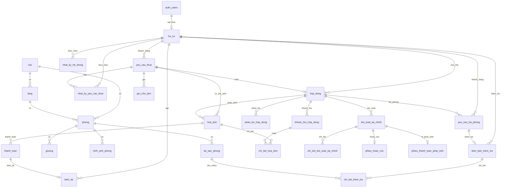
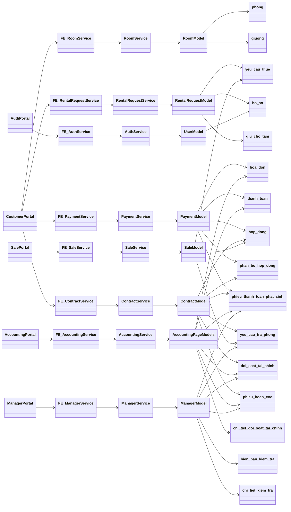
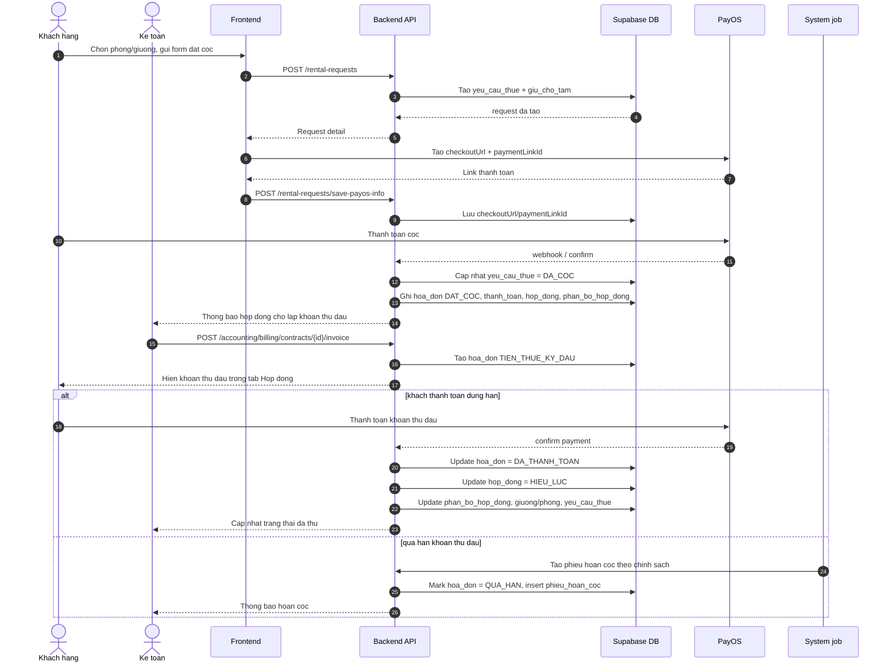
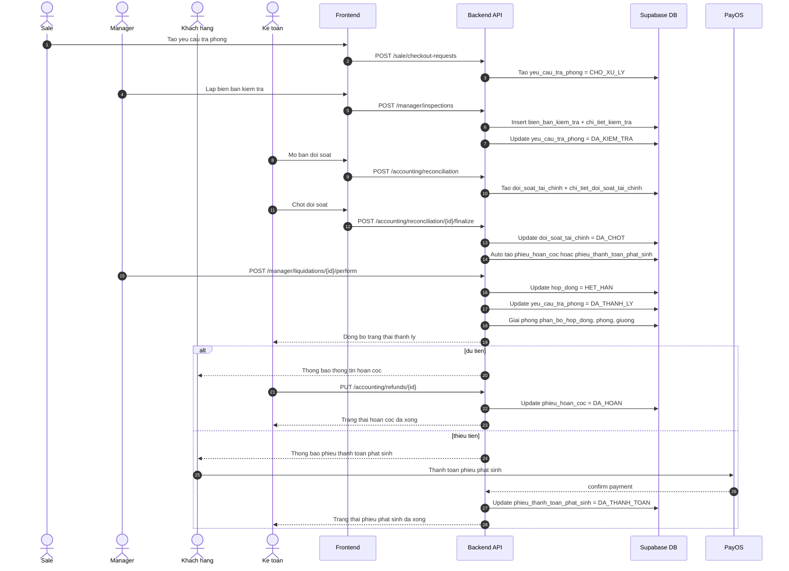

# scriptDbDessign

Tai lieu nay gom schema chinh trong `backend/supabase/scripts.sql`, 5 migration SQL, va cach code runtime dang dung DB. Muc tieu: doc 1 lan la thay duong di cua du lieu, khong bi lo bang phu hay status legacy.

## 1. Quy uoc chung

- PK chinh dung `bigint generated by default as identity`.
- `created_at` va `updated_at` la audit field; `updated_at` duoc trigger `set_updated_at()` cap nhat tu dong.
- `trang_thai`, `vai_tro`, `loai_*` deu la `varchar`, khong bi enum hoa het trong DB, nen app co runtime normalize.
- `ho_so` la profile nghiep vu chinh. `profiles` la bang legacy/fallback cho Supabase Auth.
- Mot so cot co polymorphic reference, vi du `chi_tiet_doi_soat_tai_chinh.ma_nguon`, `nhat_ky_he_thong.ma_ban_ghi`.
- Data model hien tai da qua 3 chinh:
  - dat coc / giu cho
  - hop dong / hoa don / thanh toan
  - tra phong / kiem tra / doi soat / hoan coc

## 2. So do quan he

## 3. Bo gia tri dung chung

### `ho_so.vai_tro`
- `KHACH_HANG`
- `NHAN_VIEN`
- `SALE`
- `QUAN_LY`
- `KE_TOAN`
- `ADMIN`

### `profiles.role` legacy
- `customer`
- `staff`
- `accounting`
- `sale`
- `admin`

### `loai_muc_tieu`
- `PHONG`
- `GIUONG`

### `phong.gioi_tinh`
- `Nam`
- `Nữ`
- `Nam/Nữ`

### `loai_phong` observed trong code
- `PHONG_CHUNG`
- `PHONG_STUDIO`
- `PHONG_RIENG`
- `STANDARD`

### `phong.trang_thai`
- Canonical UI/runtime: `TRONG`, `SAP_DAY`, `DAY`, `BAO_TRI`
- Alias/legacy duoc runtime accept: `CON_TRONG`, `DA_THUE`, `DA_THUE_HET`, `DANG_O`, `DANG_SU_DUNG`

### `giuong.trang_thai`
- Canonical: `TRONG`, `DA_THUE`
- Alias/legacy: `CON_TRONG`, `DANG_GIU`, `DANG_O`, `DANG_SU_DUNG`, `DA_THUE_HET`

### `giu_cho_tam.trang_thai`
- `DANG_GIU`
- `DA_XAC_NHAN_COC`
- `HET_HAN`
- `HUY` co the xuat hien o data cu, nhung khong phai luong chinh

### `yeu_cau_thue.trang_thai`
- `MOI_TAO`
- `DANG_XU_LY`
- `CHO_THANH_TOAN`
- `DA_COC`
- `DA_XAC_NHAN`
- `QUA_HAN`
- `TU_CHOI`, `TAM_DUNG` la legacy read-only status tu flow sale cu
- `DA_DUYET` la legacy alias, khong con duoc ghi moi

### `hop_dong.trang_thai`
- `CHO_LAP_KHOAN_THU_DAU`
- `CHO_THANH_TOAN_KY_DAU`
- `CHO_HIEU_LUC`
- `HIEU_LUC`
- `HET_HAN`
- `DA_KET_THUC`
- `DA_KY` la legacy value co trong migration / data cu

### `hoa_don.loai_hoa_don`
- `DAT_COC`
- `TIEN_THUE_KY_DAU`
- `PHAT_SINH_DICH_VU`
- Code accounting co the nhan them `EXTRA`, `FINAL`, `DOI_SOAT`, nhung DB hien tai van la `varchar`

### `hoa_don.trang_thai`
- `CHO_THANH_TOAN`
- `DA_THANH_TOAN`
- `QUA_HAN`
- `DA_HUY`

### `thanh_toan.trang_thai`
- `CHO_XAC_NHAN`
- `DA_XAC_NHAN`
- `THAT_BAI`
- `DA_HUY`

### `phieu_hoan_coc.trang_thai`
- `CHO_HOAN`
- `DANG_XU_LY`
- `DA_HOAN`
- `HOAN_TAT`
- `THAT_BAI`

### `phieu_thanh_toan_phat_sinh.trang_thai`
- `CHO_THANH_TOAN`
- `DA_THANH_TOAN`
- `THAT_BAI`

### `yeu_cau_tra_phong.trang_thai`
- `CHO_XU_LY`
- `DANG_KIEM_TRA`
- `DA_KIEM_TRA`
- `DA_THANH_LY`
- `HOAN_TAT` la legacy alias, da duoc cleanup ve `DA_THANH_LY`

### `bien_ban_kiem_tra.trang_thai`
- `DA_KIEM_TRA`

### `doi_soat_tai_chinh.trang_thai`
- `CHO_CHOT`
- `DANG_LAP`
- `DA_CHOT`
- `LECH_SO_LIEU`

### `chi_tiet_doi_soat_tai_chinh.huong_giao_dich`
- `THU`
- `CHI`

### `nhat_ky_he_thong.hanh_dong`
- `TAO_SAN_SAU_COC`
- `KICH_HOAT_HOP_DONG`
- `THANH_TOAN_COC_THANH_CONG`
- `THANH_TOAN_PAYOS_THANH_CONG`
- `XAC_NHAN_YEU_CAU`
- `THANH_LY_HOP_DONG`

## 4. Bang va cot

### `ho_so`
Bang profile nghiep vu trung tam. Moi user auth co the co 1 ho_so, nhung ho_so van co the ton tai khong gan auth.

| Cot | Kieu | Vai tro | Ghi chu |
| --- | --- | --- | --- |
| `ma_ho_so` | bigint PK | Dinh danh ho so | identity |
| `ma_nguoi_dung_xac_thuc` | uuid FK `auth.users(id)` | Noi voi Supabase Auth | unique, `on delete set null` |
| `vai_tro` | varchar(50) | Role nghiep vu | dung bo gia tri o muc 3 |
| `ho_ten` | varchar(150) | Ten hien thi | co the null |
| `email` | varchar(255) | Email lien he | unique |
| `so_dien_thoai` | varchar(20) | SDT | duoc index |
| `dia_chi_thuong_tru` | text | Dia chi | thong tin ca nhan |
| `avatar_url` | text | Anh dai dien | lay tu storage/public url |
| `ngan_hang_ten` | varchar(100) | Ten ngan hang | dung cho hoan coc / thanh toan phat sinh |
| `ngan_hang_so_tai_khoan` | varchar(50) | So tai khoan | optional |
| `ngan_hang_chu_tai_khoan` | varchar(150) | Chu tai khoan | optional |
| `so_cccd` | varchar(20) | So CCCD | dung cho ho so thuê |
| `ngay_cap_cccd` | date | Ngay cap CCCD | optional |
| `cccd_mat_truoc_url` | text | Anh mat truoc | checklist ho so |
| `cccd_mat_sau_url` | text | Anh mat sau | checklist ho so |
| `lien_he_khan_cap_ho_ten` | varchar(150) | Lien he khan cap | emergency contact |
| `lien_he_khan_cap_sdt` | varchar(20) | SDT khan cap | emergency contact |
| `lien_he_khan_cap_moi_quan_he` | varchar(50) | Quan he | vo/chong/anh/chi/... |
| `created_at` / `updated_at` | timestamptz | Audit | `updated_at` auto bump |

Quan he: `ho_so` duoc tham chieu boi `yeu_cau_thue`, `hop_dong`, `thanh_toan`, `bien_lai`, `yeu_cau_tra_phong`, `bien_ban_kiem_tra`, `nhat_ky_*`.

### `profiles`
Bang legacy/fallback cho auth middleware. Khong phai bang nghiep vu chinh.

| Cot | Kieu | Vai tro | Ghi chu |
| --- | --- | --- | --- |
| `id` | uuid PK/FK `auth.users(id)` | Link auth | `on delete cascade` |
| `updated_at` | timestamptz | Audit | default `now()` |
| `full_name` | text | Ten | legacy |
| `phone` | text | SDT | legacy |
| `avatar_url` | text | Anh dai dien | legacy |
| `role` | text | Role fallback | default `customer` |

### `toa`

| Cot | Kieu | Vai tro | Ghi chu |
| --- | --- | --- | --- |
| `ma_toa` | bigint PK | Dinh danh toa | identity |
| `ma_dinh_danh` | varchar(100) | Ma quan ly | unique, dung cho seed/test |
| `ten` | varchar(255) | Ten toa | vi du `Khu A - Nam` |
| `dia_chi` | text | Dia chi | optional |
| `quan_huyen` | varchar(100) | Khu vuc | optional |
| `thanh_pho` | varchar(100) | Thanh pho | optional |
| `created_at` / `updated_at` | timestamptz | Audit |  |

Quan he: 1 toa co nhieu tang, nhieu phong.

### `tang`

| Cot | Kieu | Vai tro | Ghi chu |
| --- | --- | --- | --- |
| `ma_tang` | bigint PK | Dinh danh tang | identity |
| `ma_toa` | bigint FK `toa(ma_toa)` | Thuoc toa | `on delete cascade` |
| `so_tang` | integer | So tang so | unique voi `ma_toa` |
| `ten_tang` | varchar(100) | Ten hien thi | vi du `Tang 1` |
| `created_at` / `updated_at` | timestamptz | Audit |  |

Quan he: 1 tang co nhieu phong.

### `phong`

| Cot | Kieu | Vai tro | Ghi chu |
| --- | --- | --- | --- |
| `ma_phong` | bigint PK | Dinh danh phong | identity |
| `ma_toa` | bigint FK `toa(ma_toa)` | Thuoc toa | `on delete restrict` |
| `ma_tang` | bigint FK `tang(ma_tang)` | Thuoc tang | `on delete restrict` |
| `ma_phong_hien_thi` | varchar(50) | Ma phong hien thi | unique theo toa |
| `loai_phong` | varchar(50) | Kieu phong | khong constraint enum, app dung gia tri o muc 3 |
| `suc_chua` | integer | Suc chua | `>= 0` |
| `gia_thang` | numeric(14,2) | Gia thue thang | `>= 0` |
| `trang_thai` | varchar(50) | Trang thai phong | luong runtime normalise |
| `gioi_tinh` | `gioi_tinh_type` | Gioi tinh | default `Nam/Nữ` |
| `created_at` / `updated_at` | timestamptz | Audit |  |

Quan he: 1 phong co the co nhieu giuong, anh, tai san. Trigger `update_room_status_by_beds` se tu dong cap nhat trang thai phong khi giuong doi trang thai.

### `giuong`

| Cot | Kieu | Vai tro | Ghi chu |
| --- | --- | --- | --- |
| `ma_giuong` | bigint PK | Dinh danh giuong | identity |
| `ma_phong` | bigint FK `phong(ma_phong)` | Thuoc phong | `on delete cascade` |
| `ma_giuong_hien_thi` | varchar(50) | Ma giuong hien thi | unique theo phong |
| `nhan_giuong` | varchar(50) | Ten/nhan giuong | vi du `Giường 1` |
| `gia_thang` | numeric(14,2) | Gia thue giuong | `>= 0` |
| `trang_thai` | varchar(50) | Trang thai giuong | dung bo gia tri o muc 3 |
| `created_at` / `updated_at` | timestamptz | Audit |  |

Quan he: 1 phong co nhieu giuong. Status giuong la dau vao de tinh `phong.trang_thai`.

### `hinh_anh_phong`

| Cot | Kieu | Vai tro | Ghi chu |
| --- | --- | --- | --- |
| `ma_hinh_anh` | bigint PK | Dinh danh anh | identity |
| `ma_phong` | bigint FK `phong(ma_phong)` | Anh cua phong | `on delete cascade` |
| `duong_dan_cong_khai` | text | URL public | dung cho frontend |
| `la_anh_bia` | boolean | Anh bia | chi 1 anh bia / phong nhan boi unique partial index |
| `thu_tu_hien_thi` | integer | Thu tu | `>= 0` |
| `created_at` / `updated_at` | timestamptz | Audit |  |

### `tai_san_phong`

| Cot | Kieu | Vai tro | Ghi chu |
| --- | --- | --- | --- |
| `ma_tai_san` | bigint PK | Dinh danh tai san | identity |
| `ma_phong` | bigint FK `phong(ma_phong)` | Thuoc phong | `on delete cascade` |
| `ma_tai_san_hien_thi` | varchar(50) | Ma tai san hien thi | unique theo phong |
| `ten_tai_san` | varchar(255) | Ten tai san | vi du `Ban hoc`, `Dieu hoa` |
| `danh_muc` | varchar(100) | Nhom tai san | dung khi kiem tra/doi soat |
| `muc_boi_thuong_mac_dinh` | numeric(14,2) | Muc boi thuong | default 0, dung tao bien ban kiem tra |
| `created_at` / `updated_at` | timestamptz | Audit |  |

### `yeu_cau_thue`

| Cot | Kieu | Vai tro | Ghi chu |
| --- | --- | --- | --- |
| `ma_yeu_cau_thue` | bigint PK | Dinh danh request | identity |
| `ma_ho_so_khach_hang` | bigint FK `ho_so(ma_ho_so)` | Khach hang | `on delete restrict` |
| `ma_ho_so_nhan_vien_phu_trach` | bigint FK `ho_so(ma_ho_so)` | Sale phu trach | optional, `set null` |
| `loai_muc_tieu` | varchar(20) | Muc tieu thue | `PHONG` / `GIUONG` |
| `ma_phong` | bigint FK `phong(ma_phong)` | Phong duoc chon | optional theo loai |
| `ma_giuong` | bigint FK `giuong(ma_giuong)` | Giuong duoc chon | legacy / single-bed case |
| `so_luong_giuong_dat` | integer | So giuong dat | migration 2026042300, default 1 |
| `ngay_du_kien_vao_o` | date | Ngay vao o | ngay du kien bat dau hop dong |
| `gia_thue_thang` | numeric(14,2) | Don gia thue | dung tinh deposit / invoice |
| `so_tien_dat_coc` | numeric(14,2) | Tien coc | request deposit |
| `trang_thai` | varchar(50) | Trang thai request | dung bo gia tri o muc 3 |
| `checkoutUrl` | text | Link PayOS | luong dat coc |
| `paymentLinkId` | text | ID PayOS | dung de confirm / cancel / lookup |
| `created_at` / `updated_at` | timestamptz | Audit |  |

Rang buoc quan trong: request phai khop target theo `loai_muc_tieu`; migration 2026042300 cho phep `GIUONG` co `ma_phong` + nhieu `giu_cho_tam`. `so_luong_giuong_dat` la key cho multi-bed booking.

### `nhat_ky_yeu_cau_thue`

| Cot | Kieu | Vai tro | Ghi chu |
| --- | --- | --- | --- |
| `ma_nhat_ky` | bigint PK | Dinh danh log | identity |
| `ma_yeu_cau_thue` | bigint FK `yeu_cau_thue(ma_yeu_cau_thue)` | Request goc | `on delete cascade` |
| `trang_thai_cu` | varchar(50) | Trang thai truoc | optional |
| `trang_thai_moi` | varchar(50) | Trang thai moi | bat buoc |
| `ma_ho_so_nguoi_thuc_hien` | bigint FK `ho_so(ma_ho_so)` | Ai thao tac | `on delete restrict` |
| `ghi_chu` | text | Ghi chu | note tu sale / he thong |
| `created_at` | timestamptz | Audit | append-only |

### `giu_cho_tam`

| Cot | Kieu | Vai tro | Ghi chu |
| --- | --- | --- | --- |
| `ma_giu_cho_tam` | bigint PK | Dinh danh hold | identity |
| `ma_yeu_cau_thue` | bigint FK `yeu_cau_thue(ma_yeu_cau_thue)` | Thuoc request | `on delete cascade` |
| `loai_muc_tieu` | varchar(20) | Loai hold | `PHONG` / `GIUONG` |
| `ma_phong` | bigint FK `phong(ma_phong)` | Room hold | optional |
| `ma_giuong` | bigint FK `giuong(ma_giuong)` | Bed hold | optional |
| `trang_thai` | varchar(50) | Trang thai hold | `DANG_GIU`, `DA_XAC_NHAN_COC`, `HET_HAN` |
| `thoi_gian_het_han` | timestamptz | Het han hold | default 24h trong RPC |
| `ly_do_huy_giu_cho` | text | Ly do huy | optional |
| `checkoutUrl` | text | Link PayOS | legacy/baseline |
| `paymentLinkid` | text | ID PayOS | typo legacy, code hien tai khong dung |
| `created_at` / `updated_at` | timestamptz | Audit |  |

Rang buoc: migration 2026042300 tao unique partial index de khong cho double-hold giuong/phong dang active.

### `hop_dong`

| Cot | Kieu | Vai tro | Ghi chu |
| --- | --- | --- | --- |
| `ma_hop_dong` | bigint PK | Dinh danh hop dong | identity |
| `ma_yeu_cau_thue` | bigint FK `yeu_cau_thue(ma_yeu_cau_thue)` | Request goc | unique, `on delete restrict` |
| `ma_ho_so_khach_hang` | bigint FK `ho_so(ma_ho_so)` | Khach thue | `on delete restrict` |
| `loai_muc_tieu` | varchar(20) | Loai thue | `PHONG` / `GIUONG` |
| `ma_phong` | bigint FK `phong(ma_phong)` | Phong | optional theo flow |
| `ma_giuong` | bigint FK `giuong(ma_giuong)` | Giuong | optional / legacy multi-bed |
| `ngay_vao_o` | date | Ngay bat dau | ngay hieu luc thuc te |
| `gia_thue_co_ban_thang` | numeric(14,2) | Gia co ban | dung cho billing |
| `so_tien_dat_coc_bao_dam` | numeric(14,2) | Tien coc | dung cho doi soat / hoan coc |
| `trang_thai` | varchar(50) | Trang thai hop dong | xem muc 3 |
| `created_at` / `updated_at` | timestamptz | Audit |  |

Quan he: hop dong la trung tam cua billing, checkout, doi soat, thanh ly. `ma_phong` va `ma_giuong` co the khac nhau tuy loai thue; phan bo thuc te nam o `phan_bo_hop_dong`.

### `hoa_don`

| Cot | Kieu | Vai tro | Ghi chu |
| --- | --- | --- | --- |
| `ma_hoa_don` | bigint PK | Dinh danh invoice | identity |
| `ma_yeu_cau_thue` | bigint FK `yeu_cau_thue(ma_yeu_cau_thue)` | Nguon tu request | nullable |
| `ma_hop_dong` | bigint FK `hop_dong(ma_hop_dong)` | Nguon tu hop dong | nullable |
| `loai_hoa_don` | varchar(50) | Loai hoa don | `DAT_COC`, `TIEN_THUE_KY_DAU`, `PHAT_SINH_DICH_VU`, ... |
| `trang_thai` | varchar(50) | Trang thai invoice | `CHO_THANH_TOAN`, `DA_THANH_TOAN`, `QUA_HAN`, `DA_HUY` |
| `tong_so_tien` | numeric(14,2) | Tong tien | `>= 0` |
| `so_tien_da_thanh_toan` | numeric(14,2) | Da thu | `<= tong_so_tien` |
| `ma_tai_khoan_ngan_hang` | varchar(100) | Tai khoan / QR ref | optional |
| `ma_tham_chieu_qr` | varchar(100) | PayOS ref | unique partial index khi khong null |
| `ngay_lap` | date | Ngay lap | default `current_date` |
| `ngay_den_han` | date | Han thanh toan | optional |
| `created_at` / `updated_at` | timestamptz | Audit |  |

Rang buoc: hoa don phai co it nhat 1 nguon (`ma_yeu_cau_thue` hoac `ma_hop_dong`). Migration 2026050500 them unique partial index cho invoice coc moi request.

### `thanh_toan`

| Cot | Kieu | Vai tro | Ghi chu |
| --- | --- | --- | --- |
| `ma_thanh_toan` | bigint PK | Dinh danh payment | identity |
| `ma_hoa_don` | bigint FK `hoa_don(ma_hoa_don)` | Invoice duoc tra | `on delete cascade` |
| `phuong_thuc` | varchar(50) | Kenh thanh toan | app dang dung `PAYOS` |
| `trang_thai` | varchar(50) | Trang thai giao dich | xem muc 3 |
| `so_tien` | numeric(14,2) | So tien giao dich | `> 0` |
| `ma_giao_dich` | varchar(100) | Ma giao dich ngoai he thong | unique partial index khi khong null |
| `ten_nguoi_thanh_toan` | varchar(150) | Ten nguoi tra | optional |
| `thoi_gian_thanh_toan` | timestamptz | Thoi diem tra | optional |
| `thoi_gian_xac_nhan` | timestamptz | Thoi diem confirm | optional |
| `created_at` / `updated_at` | timestamptz | Audit |  |

Quan he: 1 invoice co the co nhieu payment event. Code dung `ma_giao_dich` de tranh ghi trung khi webhook PayOS go lai.

### `bien_lai`

| Cot | Kieu | Vai tro | Ghi chu |
| --- | --- | --- | --- |
| `ma_bien_lai` | bigint PK | Dinh danh bien lai | identity |
| `ma_thanh_toan` | bigint FK `thanh_toan(ma_thanh_toan)` | Payment goc | `on delete restrict` |
| `ma_hoa_don` | bigint FK `hoa_don(ma_hoa_don)` | Invoice goc | `on delete restrict` |
| `so_tien` | numeric(14,2) | So tien bien lai | `> 0` |
| `so_bien_lai` | varchar(100) | So bien lai in ra | unique |
| `thoi_gian_lap` | timestamptz | Gio lap | default `now()` |
| `ma_ho_so_nguoi_lap` | bigint FK `ho_so(ma_ho_so)` | Ai lap | `on delete restrict` |
| `created_at` / `updated_at` | timestamptz | Audit |  |

### `phan_bo_hop_dong`

| Cot | Kieu | Vai tro | Ghi chu |
| --- | --- | --- | --- |
| `ma_phan_bo` | bigint PK | Dinh danh phan bo | identity |
| `ma_hop_dong` | bigint FK `hop_dong(ma_hop_dong)` | Hop dong | `on delete cascade` |
| `loai_muc_tieu` | varchar(20) | Loai phan bo | `PHONG` / `GIUONG` |
| `ma_phong` | bigint FK `phong(ma_phong)` | Room | optional theo flow |
| `ma_giuong` | bigint FK `giuong(ma_giuong)` | Bed | optional theo flow |
| `ngay_bat_dau` | date | Bat dau phan bo | bat buoc |
| `ngay_ket_thuc` | date | Ket thuc phan bo | nullable |
| `trang_thai` | varchar(50) | Trang thai phan bo | app dung `CHO_HIEU_LUC`, `HIEU_LUC`, `HET_HAN` |
| `created_at` / `updated_at` | timestamptz | Audit |  |

Quan he: bang nay quan trong cho multi-bed contract va tinh room availability.

### `khoan_thu_hop_dong`

| Cot | Kieu | Vai tro | Ghi chu |
| --- | --- | --- | --- |
| `ma_khoan_thu` | bigint PK | Dinh danh khoan thu | identity |
| `ma_hop_dong` | bigint FK `hop_dong(ma_hop_dong)` | Thuoc hop dong | `on delete cascade` |
| `giai_doan_phat_sinh` | varchar(50) | Giai doan | vi du `KY_DAU` |
| `danh_muc` | varchar(100) | Nhom khoan thu | vi du `TIEN_THUE_THANG_DAU`, `PHU_PHI` |
| `mo_ta` | text | Mo ta | ten line item |
| `so_tien` | numeric(14,2) | So tien | `>= 0` |
| `trang_thai_lap_hoa_don` | varchar(50) | Da lap invoice chua | `CHUA_LAP`, `DA_LAP` |
| `ma_hoa_don_da_lap` | bigint FK `hoa_don(ma_hoa_don)` | Invoice da sinh | nullable |
| `created_at` / `updated_at` | timestamptz | Audit |  |

### `chi_tiet_hoa_don`

| Cot | Kieu | Vai tro | Ghi chu |
| --- | --- | --- | --- |
| `ma_chi_tiet_hoa_don` | bigint PK | Dinh danh dong | identity |
| `ma_hoa_don` | bigint FK `hoa_don(ma_hoa_don)` | Thuoc invoice | `on delete cascade` |
| `ma_khoan_thu` | bigint FK `khoan_thu_hop_dong(ma_khoan_thu)` | Goc khoan thu | nullable |
| `danh_muc` | varchar(100) | Nhom dong | vi du `TIEN_THUE_THANG_DAU`, `PHU_PHI` |
| `mo_ta` | text | Mo ta dong | optional |
| `so_luong` | numeric(12,2) | So luong | `> 0` |
| `don_gia` | numeric(14,2) | Don gia | `>= 0` |
| `thanh_tien` | numeric(14,2) | Thanh tien | `>= 0` |
| `created_at` / `updated_at` | timestamptz | Audit |  |

### `yeu_cau_tra_phong`

| Cot | Kieu | Vai tro | Ghi chu |
| --- | --- | --- | --- |
| `ma_yeu_cau_tra_phong` | bigint PK | Dinh danh checkout request | identity |
| `ma_hop_dong` | bigint FK `hop_dong(ma_hop_dong)` | Hop dong can tra | `on delete restrict` |
| `ma_ho_so_khach_hang` | bigint FK `ho_so(ma_ho_so)` | Khach hang | `on delete restrict` |
| `ngay_yeu_cau_tra_phong` | date | Ngay yeu cau | bat buoc |
| `gio_ban_giao` | time | Gio ban giao | optional |
| `ly_do` | text | Ly do tra phong | optional |
| `trang_thai` | varchar(50) | Trang thai checkout | xem muc 3 |
| `created_at` / `updated_at` | timestamptz | Audit |  |

Quan he: day la diem bat dau cho inspection, reconciliation, va liquidation.

### `bien_ban_kiem_tra`

| Cot | Kieu | Vai tro | Ghi chu |
| --- | --- | --- | --- |
| `ma_bien_ban_kiem_tra` | bigint PK | Dinh danh bien ban | identity |
| `ma_yeu_cau_tra_phong` | bigint FK `yeu_cau_tra_phong(ma_yeu_cau_tra_phong)` | Checkout request | `on delete cascade` |
| `ma_hop_dong` | bigint FK `hop_dong(ma_hop_dong)` | Hop dong | `on delete restrict` |
| `ma_ho_so_nguoi_kiem_tra` | bigint FK `ho_so(ma_ho_so)` | Nguoi kiem tra | `on delete restrict` |
| `thoi_gian_kiem_tra` | timestamptz | Gio kiem tra | default `now()` |
| `tong_uoc_tinh_khau_tru` | numeric(14,2) | Tong truoc thu | tong boi thuong uoc tinh |
| `trang_thai` | varchar(50) | Trang thai bien ban | app dang dung `DA_KIEM_TRA` |
| `created_at` / `updated_at` | timestamptz | Audit |  |

### `chi_tiet_kiem_tra`

| Cot | Kieu | Vai tro | Ghi chu |
| --- | --- | --- | --- |
| `ma_chi_tiet_kiem_tra` | bigint PK | Dinh danh dong | identity |
| `ma_bien_ban_kiem_tra` | bigint FK `bien_ban_kiem_tra(ma_bien_ban_kiem_tra)` | Thuoc bien ban | `on delete cascade` |
| `ma_tai_san_phong` | bigint FK `tai_san_phong(ma_tai_san)` | Tai san lien ket | nullable |
| `ten_tai_san` | varchar(255) | Ten tai san | snapshot tai luc kiem tra |
| `tinh_trang` | varchar(100) | Mo ta tinh trang | vi du `Vo mat kinh ban hoc` |
| `so_tien_boi_thuong` | numeric(14,2) | Tien boi thuong | `>= 0` |
| `created_at` / `updated_at` | timestamptz | Audit |  |

### `doi_soat_tai_chinh`

| Cot | Kieu | Vai tro | Ghi chu |
| --- | --- | --- | --- |
| `ma_doi_soat` | bigint PK | Dinh danh doi soat | identity |
| `ma_hop_dong` | bigint FK `hop_dong(ma_hop_dong)` | Hop dong | `on delete restrict` |
| `so_tien_dat_coc_ban_dau` | numeric(14,2) | Tien coc goc | snapshot |
| `so_tien_hoan_lai` | numeric(14,2) | Tien hoan lai | >= 0 |
| `so_tien_can_thanh_toan_them` | numeric(14,2) | Tien can thu them | >= 0 |
| `trang_thai` | varchar(50) | Trang thai doi soat | xem muc 3 |
| `created_at` / `updated_at` | timestamptz | Audit |  |

Quan he: doi soat la hop tac giua checkout inspection va cac voucher tai chinh.

### `chi_tiet_doi_soat_tai_chinh`

| Cot | Kieu | Vai tro | Ghi chu |
| --- | --- | --- | --- |
| `ma_chi_tiet_doi_soat` | bigint PK | Dinh danh dong | identity |
| `ma_doi_soat` | bigint FK `doi_soat_tai_chinh(ma_doi_soat)` | Thuoc doi soat | `on delete cascade` |
| `danh_muc` | varchar(100) | Nhom nghiep vu | vi du `TIEN_DICH_VU`, `BOI_THUONG_HU_HONG`, `DIEU_CHINH_HOAN_THEM` |
| `huong_giao_dich` | varchar(20) | Huong | `THU` / `CHI` |
| `loai_nguon` | varchar(50) | Loai nguon polymorphic | `HOA_DON`, `KIEM_TRA`, `null` |
| `ma_nguon` | bigint | ID nguon polymorphic | khong FK cu the |
| `so_tien` | numeric(14,2) | So tien | `>= 0` |
| `mo_ta` | text | Mo ta dong | optional |
| `created_at` / `updated_at` | timestamptz | Audit |  |

### `phieu_thanh_toan_phat_sinh`

| Cot | Kieu | Vai tro | Ghi chu |
| --- | --- | --- | --- |
| `ma_phieu_tt_phat_sinh` | bigint PK | Dinh danh voucher | identity |
| `ma_doi_soat` | bigint FK `doi_soat_tai_chinh(ma_doi_soat)` | Doi soat goc | `on delete cascade` |
| `ma_hop_dong` | bigint FK `hop_dong(ma_hop_dong)` | Hop dong | `on delete restrict` |
| `so_tien_thanh_toan` | numeric(14,2) | Tien phat sinh can thu | `>= 0` |
| `trang_thai` | varchar(50) | Trang thai | xem muc 3 |
| `created_at` / `updated_at` | timestamptz | Audit |  |

### `phieu_hoan_coc`

| Cot | Kieu | Vai tro | Ghi chu |
| --- | --- | --- | --- |
| `ma_phieu_hoan_coc` | bigint PK | Dinh danh voucher | identity |
| `ma_doi_soat` | bigint FK `doi_soat_tai_chinh(ma_doi_soat)` | Doi soat goc | `on delete cascade` |
| `ma_hop_dong` | bigint FK `hop_dong(ma_hop_dong)` | Hop dong | `on delete restrict` |
| `so_tien_hoan` | numeric(14,2) | Tien hoan | `>= 0` |
| `ten_nguoi_nhan` | varchar(150) | Nguoi nhan tien | bat buoc |
| `trang_thai` | varchar(50) | Trang thai | xem muc 3 |
| `created_at` / `updated_at` | timestamptz | Audit |  |

### `nhat_ky_he_thong`

| Cot | Kieu | Vai tro | Ghi chu |
| --- | --- | --- | --- |
| `ma_nhat_ky_he_thong` | bigint PK | Dinh danh log | identity |
| `ten_bang` | varchar(100) | Ten bang goc | polymorphic |
| `ma_ban_ghi` | bigint | ID ban ghi goc | polymorphic, khong FK |
| `hanh_dong` | varchar(50) | Loai hanh dong | xem muc 3 |
| `ma_ho_so_nguoi_thuc_hien` | bigint FK `ho_so(ma_ho_so)` | Nguoi thuc hien | nullable |
| `thoi_gian_tao` | timestamptz | Gio tao log | default `now()` |
| `ghi_chu` | text | Ghi chu | nhat ky nghiep vu |

## 5. Constraints, index, trigger can nhin nhanh

### Unique / check
- `tang`: unique `(ma_toa, so_tang)`
- `phong`: unique `(ma_toa, ma_phong_hien_thi)`
- `giuong`: unique `(ma_phong, ma_giuong_hien_thi)`
- `hinh_anh_phong`: unique partial 1 anh bia / phong
- `tai_san_phong`: unique `(ma_phong, ma_tai_san_hien_thi)`
- `yeu_cau_thue`: check target theo `loai_muc_tieu`
- `hoa_don`: check `so_tien_da_thanh_toan <= tong_so_tien`
- `thanh_toan`: unique `ma_giao_dich` khi khong null
- `bien_lai`: unique `so_bien_lai`
- `phan_bo_hop_dong`: check ngay ket thuc >= ngay bat dau
- `chi_tiet_doi_soat_tai_chinh`: check `huong_giao_dich in ('THU','CHI')`
- migration 2026050500: unique deposit invoice per request
- migration 2026050500: unique `phieu_hoan_coc` per `ma_doi_soat`
- migration 2026050500: unique `phieu_thanh_toan_phat_sinh` per `ma_doi_soat`
- migration 2026042300: unique active hold per bed/room

### Trigger / function
- `set_updated_at()`: cap nhat `updated_at`
- `handle_new_auth_user()`: tao `ho_so` + `profiles` tu `auth.users`
- `update_room_status_by_beds()`: tinh trang thai phong theo giuong
- `trigger_update_room_status_on_bed_change()`: trigger sau update giuong
- `create_rental_request_with_holds()`: tao request + hold atomically
- `expire_stale_holds()`: het han hold qua han
- `confirm_rental_payment()`: chot coc va active hold

### Storage
- Bucket `profiles` public
- Policy: public read, authenticated insert

## 6. Note nghiep vu

- `ho_so` la bang can chinh cho user business. Neu build dashboard / relation, uu tien `ho_so` truoc `profiles`.
- `giu_cho_tam` la bang giu cho tam thoi, khong phai bang trang thai phong/giuong.
- `phan_bo_hop_dong` giu history phan bo, khong nen thay the bang `hop_dong`.
- `chi_tiet_doi_soat_tai_chinh` va `nhat_ky_he_thong` la polymorphic log, nen doc theo `ten_bang` + `ma_ban_ghi`.
- `paymentLinkid` trong `giu_cho_tam` la cot legacy/typo, code hien tai khong dung; `paymentLinkId` o `yeu_cau_thue` moi la cot active cho luong PayOS.
- `so_luong_giuong_dat` la cot quan trong de doc multi-bed booking va tinh deposit.
- Flow sale khong con duyet/tam dung/tu cho yeu cau thue; sale chi xem yeu cau va tao yeu cau tra phong.
- Migration `2026051000_cleanup_sale_checkout_statuses.sql` chuan hoa `DA_DUYET` -> `DA_XAC_NHAN` va `HOAN_TAT` -> `DA_THANH_LY`.
- `yeu_cau_tra_phong` chot thanh `DA_THANH_LY`; `HOAN_TAT` chi la alias cu trong data legacy.
- `thong_bao` hien chua co bang rieng trong DB; sequence xem nhu app side-effect / UI state / service notify.

## 7. Class diagram 3 layer

Quy uoc doc nhanh: `*Portal` va `FE_*Service` la tang giao dien, `*Service` la tang nghiep vu backend, `*Model` va cac bang snake_case la tang du lieu.

## 8. Sequence diagrams

### Flow 1 - Dat phong/giuong -> coc -> hop dong -> khoan thu dau -> kich hoat

### Flow 2 - Tra phong -> kiem tra -> doi soat -> thanh ly -> thanh toan/hoan coc

